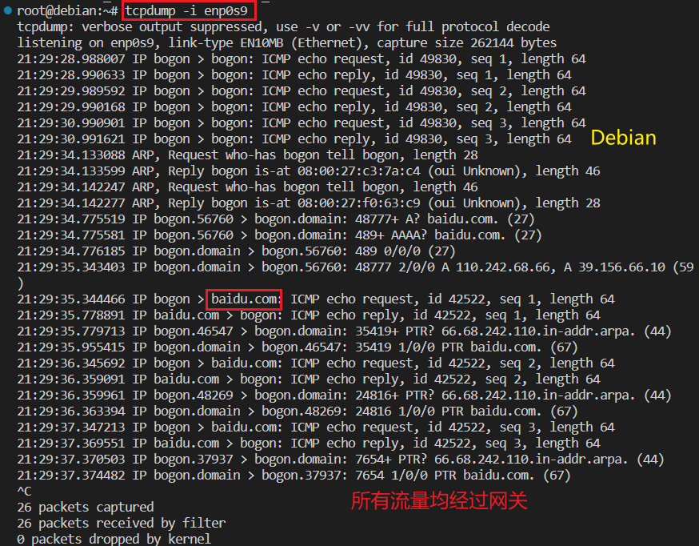

# 基于 VirtualBox 的网络攻防基础环境搭建

## 实验目的

* 掌握 VirtualBox 虚拟机的安装与使用；
* 掌握 VirtualBox 的虚拟网络类型和按需配置；
* 掌握 VirtualBox 的虚拟硬盘多重加载；

## 实验环境

以下是本次实验需要使用的网络节点说明和主要软件举例：

* VirtualBox 虚拟机
* 攻击者主机（Attacker）：Kali Rolling 2022.3
* 网关（Gateway, GW）：Debian Buster
* 靶机（Victim）：xp-sp3 / Kali

## 实验要求

* - [x] 虚拟硬盘配置成多重加载，效果如下图所示；


* - [x] 搭建满足如下拓扑图所示的虚拟机网络拓扑；


> 根据实验宿主机的性能条件，可以适度精简靶机数量

* 完成以下网络连通性测试；
    - [x] 靶机可以直接访问攻击者主机
    - [x] 攻击者主机无法直接访问靶机
    - [x] 网关可以直接访问攻击者主机和靶机
    - [x] 靶机的所有对外上下行流量必须经过网关
    - [x] 所有节点均可以访问互联网

## 实验步骤

### 配置多重加载

由于课前预习时已经将普通类型的vdi文件与虚拟机相关联，所以只需要修改虚拟硬盘类型即可。

打开`管理 → 虚拟介质管理`，选中所需更改虚拟硬盘，更改类型，选择应用


设置成功


kali，xp虚拟硬盘操作同上，此处省略

### 搭建网络拓扑

本次实验所搭建网络拓扑表示如下：


**网关**——4块网卡

- NAT网络：使网关可以访问攻击者主机
- 仅主机（Host-Only）网络：
- 内部网络intnet1，访问局域网1
- 内部网络intnet2，访问局域网2


**攻击者**——1块网卡

- NAT网络


**靶机**——1块网卡

- 内部网络：使两台靶机处于不同局域网中


### 网络连通性测试

为方便对照测试结果，将不同机型与IP地址的对应关系总结如下：

|                | 网卡类型  | IP             |
| -------------- | --------- | -------------- |
| Gateway-Debian | NAT网络   | 10.0.2.4       |
| Gateway-Debian | Host-Only | 192.168.56.113 |
| Gateway-Debian | intnet1   | 172.16.111.1   |
| Gateway-Debian | intnet2   | 172.16.222.1   |
| Attacker-Kali  | NAT网络   | 10.0.2.15      |
| Victim-Kali    | intnet1   | 172.16.111.118 |
| Victim-XP      | intnet2   | 172.16.222.110 |

**靶机**

- 可以直接访问攻击者主机
- 所有对外上下行流量必须经过网关
- 可以访问互联网

Kali：




XP：


**攻击者**

- 无法直接访问靶机
- 可以访问互联网


**网关**

- 可以直接访问攻击者主机和靶机
- 可以访问互联网

首先清空arp表


连通性测试


查看arp表，出现新信息


## 实验总结

- 实验一开始配置Gatway网络就开始和指导视频不一样，对于网卡1配置NAT网络时出现报错——发现无效设置

  

  上网搜索教程发现Virtualbox默认没有安装NAT网络，需要自己手动配置

  在管理→全局设定→网络，添加NAT网络后成功

  

- ssh连接失败

  通过ssh远程连接Debian时权限不足

  

  查看ssh配置文件sudo vi /etc/ssh/sshd_config，将#PermitRootLogin yes一行的注释符删除后重启ssh服务

  ```
  sudo vi /etc/ssh/sshd_config
  #将注释符删掉
  #PermitRootLogin
  service sshd restart
  ```

  

  成功

  

- Debian中使用查看arp表失败

  

  搜索教程后发现需要安装网络管理工具包`net-tools`

  ```
  apt update && apt install net-tools
  ```

- 网关无法ping通XP靶机

  测试中网关对于Kali靶机连通性测试成功，但是对于XP靶机却连接失败，而XP靶机却可以ping通网关，后来发现需要开启防火墙ping功能

  

  设置 -> 控制面板 -> windows防火墙 -> ‘高级’标签里面有关于ICMP的设定

  

  连接成功

## 参考链接

- [解决virtualbox虚拟机设置nat网络提示无效设置](https://jingyan.baidu.com/article/a3f121e4850c98fc9052bb97.html)
- [arp 命令详解](https://commandnotfound.cn/linux/1/110/arp-命令)
- [linux 清除 arp 缓存](https://blog.csdn.net/u011641885/article/details/48175239)