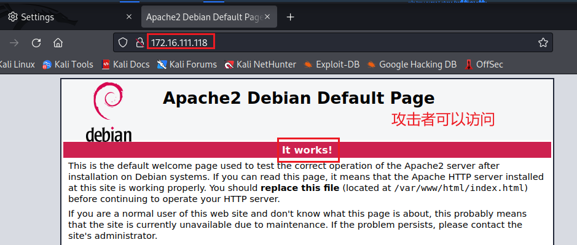

# HTTP代理服务器实验

## 实验要求

- 在 Kali Linux 中安装 tinyproxy，然后用主机设置浏览器代理指向 tinyproxy 建立的 HTTP 正向代理
- 在 Kali 中用 wireshark 抓包，分析抓包过程，理解 HTTP 正向代理 HTTPS 流量的特点

## 实验步骤

### 网络拓扑

与实验一相同


### 连通性测试

IP地址与机型对照如下：

| 机型           | 连接方式 | IP地址         |
| -------------- | -------- | -------------- |
| Gateway-Debian | NAT网络  | 10.0.2.4       |
| Gateway-Debian | intnet1  | 172.16.111.1   |
| Attacker-Kali  | NAT网络  | 10.0.2.6       |
| Victim-Kali    | intnet1  | 172.16.111.118 |

**攻击者**不能ping通靶机，可以ping通网关，可以上网


**网关**可以ping通攻击者，可以ping通靶机，可以上网


**靶机**可以ping通攻击者，可以ping通网关，可以上网


### 安装配置tinyproxy

- 在网关中安装tinyproxy，并编辑tinyproxy配置文件，使网关可以作为代理服务器

  ```
  #安装tinyproxy
  sudo apt update & apt install tinyproxy
  
  # 备份tinyproxy配置文件
  cp /etc/tinyproxy/tinyproxy.conf /etc/tinyproxy/tinyproxy.conf.bak
  
  # 编辑tinyproxy配置文件
  sudo vim /etc/tinyproxy/tinyproxy.conf
  
  # 取消Allow 10.0.0.0/8的注释
  ```

  

### 开启tinyproxy服务，并配置代理服务

- 在网关开启tinyproxy

  ```
  systemctl tinyproxy start
  ```

  

- 在靶机开启apache服务

  ```
  systemctl apache2 start
  ```

  

  但是攻击者仍然无法访问靶机

  

- 在攻击者浏览器配置，将网关设为代理，端口设为默认值8888

  

### 靶机抓包并分析（HTTP）

- 在靶机上开启抓包

  ```
  tcpdump -i eth0 -n -s 65535 -w attacker.pcap
  ```

- 攻击者再次使用浏览器访问靶机，发现可以访问成功了，此次访问也被靶机抓包记录

  

- 使用wireshark查看抓包记录，设置表达式只留下http协议，并选择追踪http流

  

  查看代理信息，这里看出我们能看到使用了代理，但是看不到具体的信息（ip地址等等信息）

  

  并且因为是http连接，可以查看到传输的明文信息

  

### 网关抓包并分析（HTTPS）

- 在网关上开启抓包，攻击者使用https协议访问任意网站

  

- 使用scp将网关上抓包的信息传输到本地，使用wireshark打开查看

  

  因为使用的是https协议，所以代理服务器无法知道客户端和服务器的通信内容

  

  但代理服务器知道客户端访问了哪个 HTTPS 站点

  

## 实验总结

- 中间攻击者使用浏览器访问靶机时，出现报错（当时忘记截图了，所以放上大致报错信息）

- ```
  401 Unauthorized
  The administrator of this proxy has not configured it to service requests from you. Generated by tinyproxy version 1.10.0.
  ```

- 但实际上我是有在配置文件中注释掉`Allow 10.0.0.0/8`，使网关可以成为代理服务器

  后面才想起，修改配置文件后没有重启，restart之后果然就成功了，所以想要修改后的配置文件生效就一定要重启啊！

  

## 参考资料

-  [HTTP代理服务器实验](https://c4pr1c3.github.io/cuc-ns/chap0x03/exp.html)

- [2019-NS-Public-chencwx](https://github.com/CUCCS/2019-NS-Public-chencwx)