# 基于 Scapy 编写端口扫描器

## 实验目的

- 掌握网络扫描之端口状态探测的基本原理

## 实验环境

- python + [scapy](https://scapy.net/)

## 实验要求

- - [x] 禁止探测互联网上的 IP ，严格遵守网络安全相关法律法规

- - [x] 完成以下扫描技术的编程实现

  - TCP connect scan / TCP stealth scan
  - TCP Xmas scan / TCP fin scan / TCP null scan
  - UDP scan

- - [x] 上述每种扫描技术的实现测试均需要测试端口状态为：`开放`、`关闭` 和 `过滤` 状态时的程序执行结果

- - [x] 提供每一次扫描测试的抓包结果并分析与课本中的扫描方法原理是否相符？如果不同，试分析原因；

- - [x] 在实验报告中详细说明实验网络环境拓扑、被测试 IP 的端口状态是如何模拟的

- （可选）复刻 `nmap` 的上述扫描技术实现的命令行参数开关

## 实验步骤

**网络环境拓扑如图：**

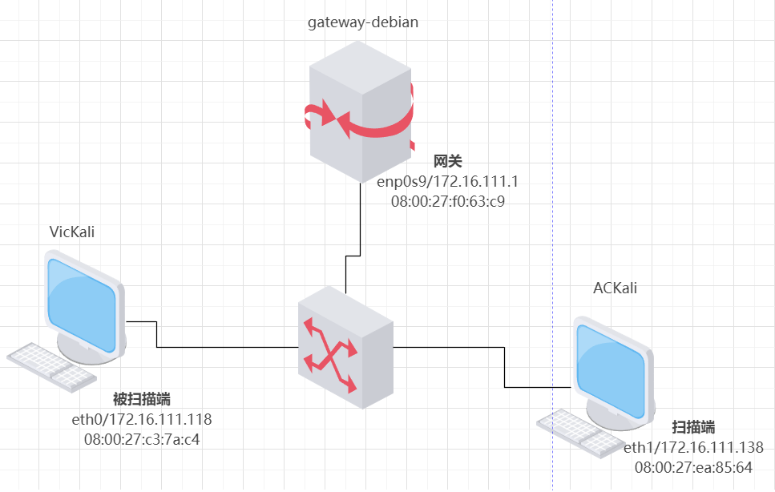

**端口状态使用模拟**

`sudo apt install ufw`安装`ufw`，管理防火墙开关情况

`apache2`对应TCP扫描，在80端口提供服务

`DNS`对应UDP扫描，在53端口提供服务

- 开放：端口开启监听，防火墙关闭

  ```shell
  systemctl start apache2 # port 80
  systemctl start dnsmasq # port 53
  
  ufw disable
  ```

- 关闭：端口未开启监听，防火墙关闭

  ```
  ufw disable
  ```

- 过滤：端口开启监听，防火墙开启

  ```shell
  systemctl start apache2 # port 80
  systemctl start dnsmasq # port 53
  
  ufw enable && ufw deny 80/tcp
  ufw enable && ufw deny 53/udp
  ```

### 1.完成以下扫描技术的编程实现

（点击跳转至相应板块）

- [TCP connect scan](#2.1.1 TCP connect scan) / [TCP stealth scan](#2.1.2 TCP stealth scan)
- [TCP Xmas scan](#2.2.1 TCP Xmas scan) / [TCP fin scan](#2.2.2 TCP fin scan) / [TCP null scan](#2.2.3 TCP null scan)
- [UDP scan](#3.1 UDP scan)

### 2.扫描技术测试

通用命令：

```shell
#展示防火墙与端口监听状态
ufw status && netstat -anop | grep LISTEN | grep -v unix && date -R
#被扫描端抓包
tcpdump -i eth0 -w XXX.pcap && date -R 
#扫描端scapy发送扫描（Attacker）
python XXX.py && date -R
#分析被扫描端抓取数据包
tshark -r XXX.pcap -Y XXX
```

#### 2.1.1 TCP connect scan

使用最基本的 TCP 三次握手链接建立机制，建立一个链接到目标主机的特定端口上。首先发送一个 SYN 数据包到目标主机的特定端口上，接着我们可以通过接收包的情况对端口的状态进行判断

- **代码**

  ```python
  import logging
  logging.getLogger("scapy.runtime").setLevel(logging.ERROR)
  # Used before importing the Scapy module inside the Python program
  # Sets logging only for errors that occur during the program execution and not the warnings.
  
  from scapy.all import *
  
  dst_ip = "172.16.111.118"   # VicKali
  src_port = 12345  # 生成一个随机数
  dst_port = 80
  
  second_server_response = sr1(IP(dst=dst_ip)/TCP(sport=src_port,dport=dst_port,flags="S"),timeout=10)
  third_client_seq   = second_server_response.ack;
  third_client_ack   = second_server_response.seq+1;
  
  
  if(str(type(second_server_response))==""):
      print('--------------------------------------------')
      print ("Filtered")
  elif(second_server_response.haslayer(TCP)):
      if(second_server_response.getlayer(TCP).flags == 0x12):
          send_rst = sr(IP(dst=dst_ip)/TCP(sport=12345,dport=dst_port,seq=third_client_seq,ack=third_client_ack,flags="A"),timeout=5)
          send_rst = sr(IP(dst=dst_ip)/TCP(sport=12345,dport=dst_port,seq=third_client_seq,ack=third_client_ack,flags="R"),timeout=5)
          print('--------------------------------------------')
          print ("Open")
  elif(second_server_response.getlayer(TCP).flags == 0x14):
      print('--------------------------------------------')
      print ("Closed")
  ```

- **开放**

  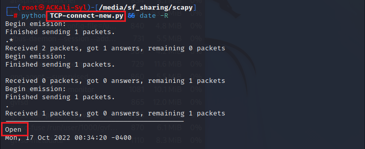

  接收到的是一个 SYN/ACK 数据包，说明端口是开放状态

  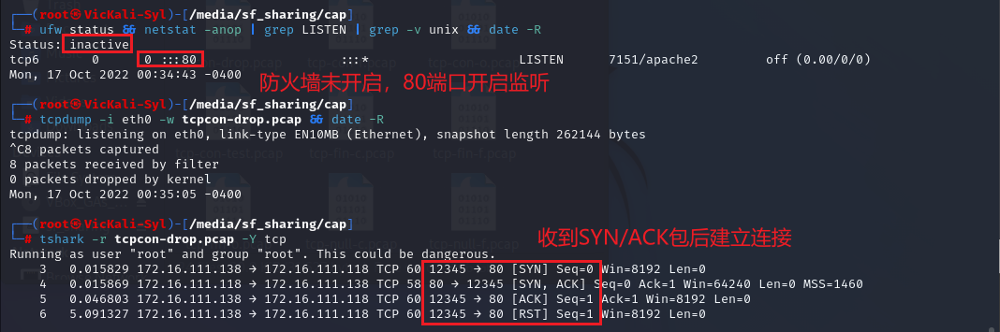

- **关闭**

  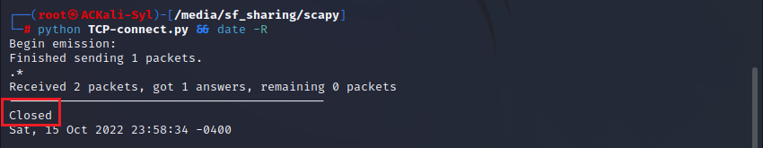

  接收到的是一个 RST/ACK 数据包，意味着端口是关闭的并且链接将会被重置

  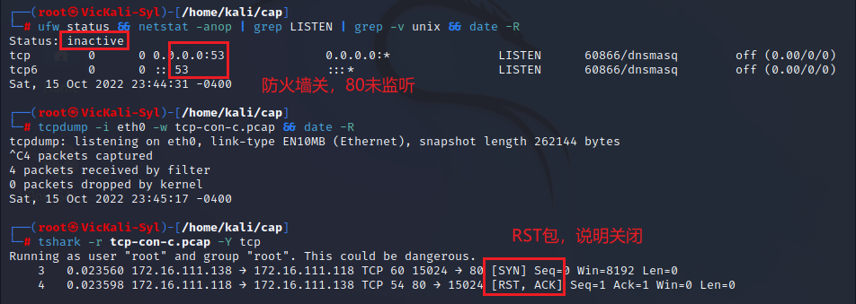

- **过滤**

  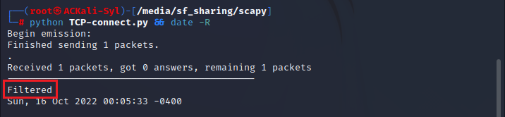

  目标主机没有任何响应,意味着目标主机的端口处于过滤状态

  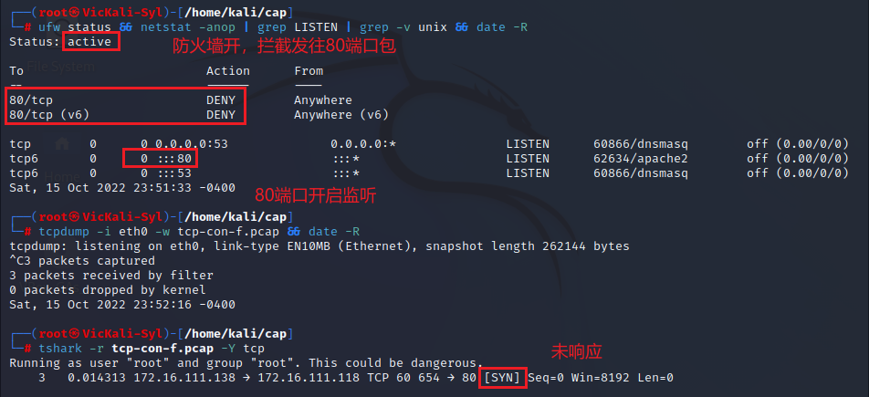

#### 2.1.2 TCP stealth scan

TCP SYN 扫描并不需要打开一个完整的链接。发送一个 SYN 包启动三方握手链接机制，并等待响应。

- **代码**

  ```python
  import logging
  logging.getLogger("scapy.runtime").setLevel(logging.ERROR)
  from scapy.all import *
  
  dst_ip = "172.16.111.118"   # VicKali
  src_port = RandShort()
  dst_port = 80
  
  stealth_scan_resp = sr1(IP(dst=dst_ip)/TCP(sport=src_port,dport=dst_port,flags="S"),timeout=10)
  print('--------------------------------------------')
  if stealth_scan_resp is None:
      print ("Filtered")
  elif(stealth_scan_resp.haslayer(TCP)):
      if(stealth_scan_resp.getlayer(TCP).flags == 0x12):
          send_rst = sr(IP(dst=dst_ip)/TCP(sport=src_port,dport=dst_port,flags="R"),timeout=10)   #拆除链接
          print ("Open")
      elif (stealth_scan_resp.getlayer(TCP).flags == 0x14):
          print ("Closed")
  ```

- **开放**

  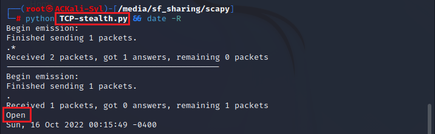

  接收到一个 SYN/ACK 包表示目标端口是开放的，扫描端并不建立一个完整的链接, 当得到的是一个 SYN/ACK 包时通过发送一个 RST 包立即拆除连接

  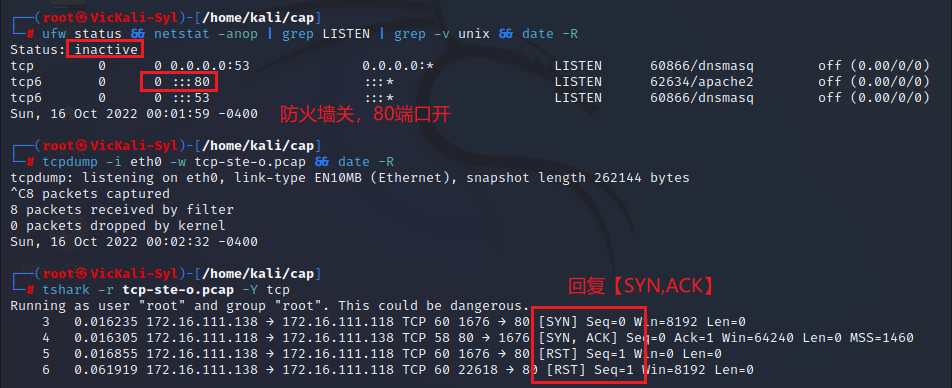

- **关闭**

  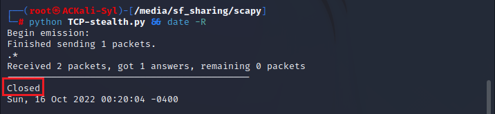

  接收到一个 RST/ACK 包表明目标端口是关闭的

  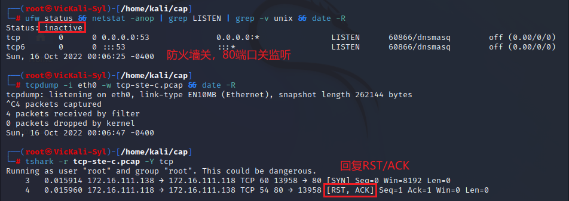

- **过滤**

  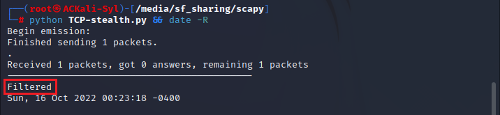

  端口是被过滤的状态则没有响应

  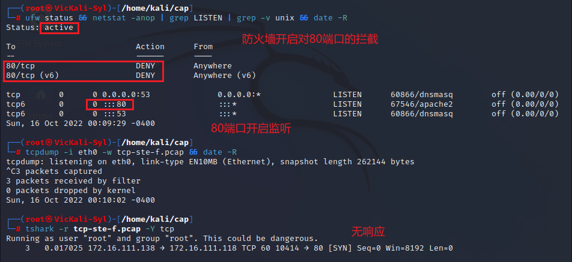

#### 2.2.1 TCP Xmas scan

Xmas 发送一个 TCP 包，并对 TCP 报文头 FIN、URG 和 PUSH 标记进行设置

- **代码**

  ```python
  import logging
  logging.getLogger("scapy.runtime").setLevel(logging.ERROR)
  from scapy.all import *
  
  dst_ip = "172.16.111.118"   # VicKali
  src_port = RandShort()
  dst_port = 80
  
  xmas_scan_resp = sr1(IP(dst=dst_ip)/TCP(dport=dst_port,flags="FPU"),timeout=10) # FIN, PUSH, URG
  print('--------------------------------------------')
  if xmas_scan_resp is None:
      print ("Open|Filtered")
  elif(xmas_scan_resp.haslayer(TCP)):
      if(xmas_scan_resp.getlayer(TCP).flags == 0x14):
          print ("Closed")
  ```

- **开放**

  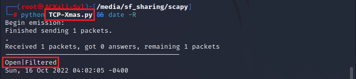

  开放或过滤状态下的端口无任何响应

  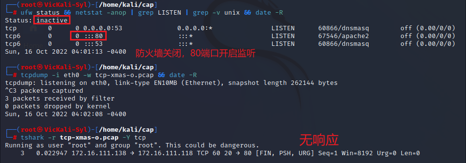

- **关闭**

  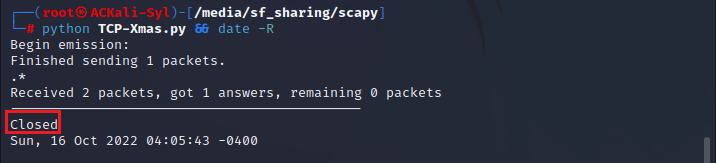

  关闭的端口响应 RST 报文

  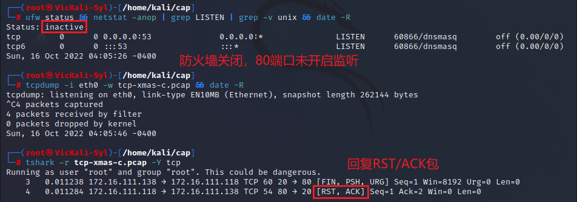

- **过滤**

  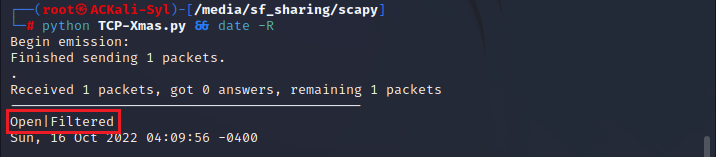

  开放或过滤状态下的端口无任何响应

  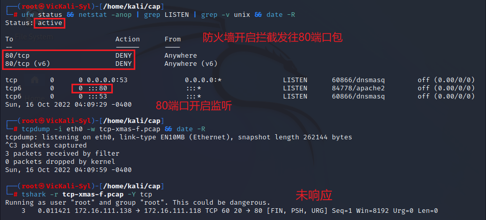

#### 2.2.2 TCP fin scan

仅发送 FIN 包，它可以直接通过防火墙

- **代码**

  ```python
  import logging
  logging.getLogger("scapy.runtime").setLevel(logging.ERROR)
  from scapy.all import *
  
  dst_ip = "172.16.111.118"   # VicKali
  src_port = RandShort()
  dst_port = 80
  
  fin_scan_resp = sr1(IP(dst=dst_ip)/TCP(dport=dst_port,flags="F"),timeout=10)
  print('--------------------------------------------')
  if fin_scan_resp is None:
      print ("Open|Filtered")
  elif(fin_scan_resp.haslayer(TCP)):
      if(fin_scan_resp.getlayer(TCP).flags == 0x14):
          print ("Closed")
  ```

- **开放**

  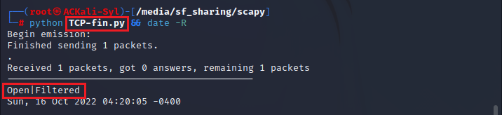

  端口是开放或过滤状态对 FIN 包没有任何响应

  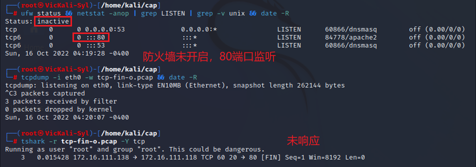

- **关闭**

  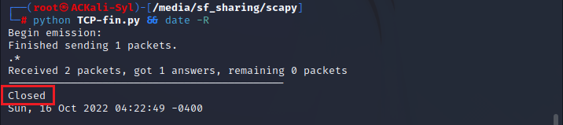

  端口是关闭的就会回复一个 RST 包

  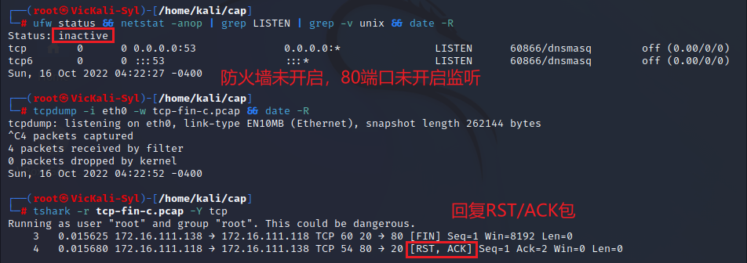

- **过滤**

  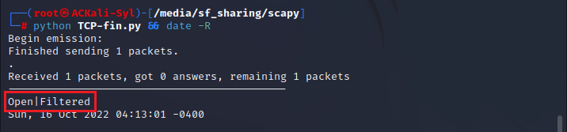

  端口是开放或过滤状态则 FIN 包没有任何响应

  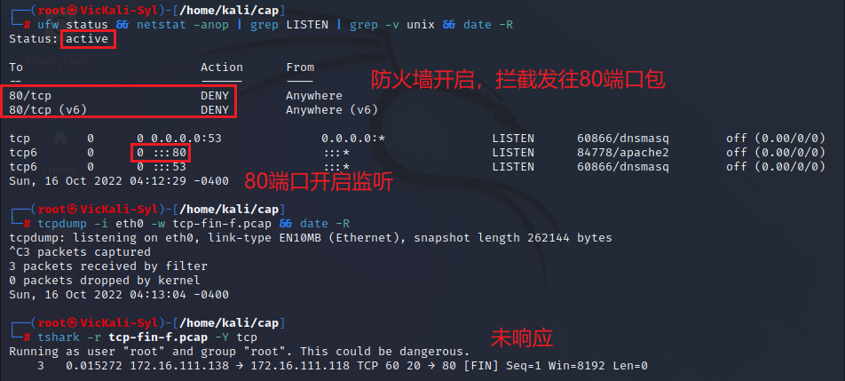

#### 2.2.3 TCP null scan

发送一个 TCP 数据包，关闭所有 TCP 报文头标记

- **代码**

  ```python
  import logging
  logging.getLogger("scapy.runtime").setLevel(logging.ERROR)
  from scapy.all import *
  
  dst_ip = "172.16.111.118"   # VicKali
  src_port = RandShort()
  dst_port = 80
  
  null_scan_resp = sr1(IP(dst=dst_ip)/TCP(dport=dst_port,flags=""),timeout=10)
  print('--------------------------------------------')
  if null_scan_resp is None:
      print ("Open|Filtered")
  elif(null_scan_resp.haslayer(TCP)):
      if(null_scan_resp.getlayer(TCP).flags == 0x14):
          print ("Closed")
  ```

- **开放**

  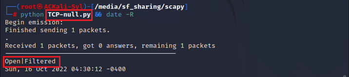

  端口为开启状态不响应

  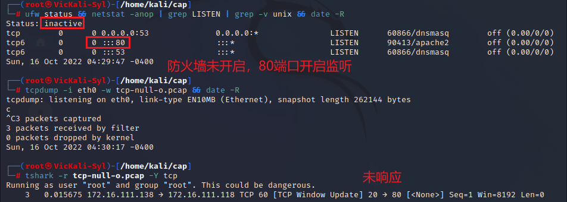

- **关闭**

  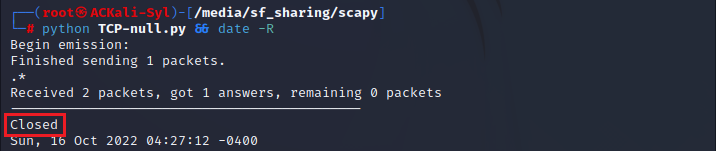

  只有关闭的端口会发送 RST 响应

  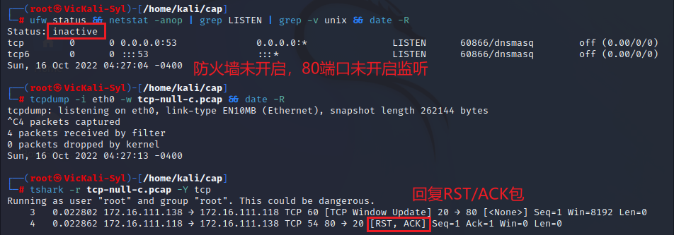

- **过滤**

  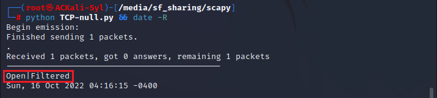

  端口为过滤状态不响应

  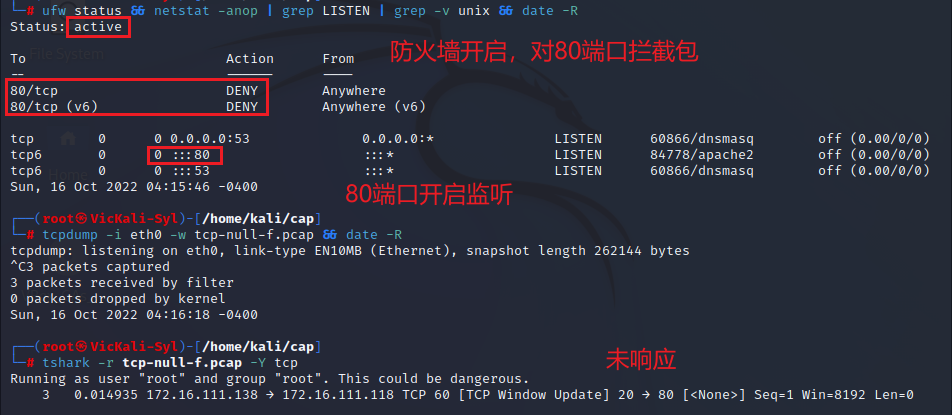

#### 3.1 UDP scan

UDP 是一个无链接的协议，当我们向目标主机的 UDP 端口发送数据,我们并不能收到一个开放端口的确认信息,或是关闭端口的错误信息。可是，在大多数情况下，当向一个未开放的 UDP 端口发送数据时,其主机就会返回一个 ICMP 不可到达(ICMP_PORT_UNREACHABLE)的错误，因此大多数 UDP 端口扫描的方法就是向各个被扫描的 UDP 端口发送零字节的 UDP 数据包

- **代码**

  ```python
  import logging
  logging.getLogger("scapy.runtime").setLevel(logging.ERROR)
  from scapy.all import *
  
  dst_ip = "172.16.111.118"   # VicKali
  src_port = RandShort()
  dst_port = 53
  dst_timeout = 10
  
  print('--------------------------------------------')
  def udp_scan(dst_ip,dst_port,dst_timeout):
      udp_scan_resp = sr1(IP(dst=dst_ip)/UDP(dport=dst_port),timeout=dst_timeout)
      if udp_scan_resp is None:
          return ("Open|Filtered")
      elif(udp_scan_resp.haslayer(ICMP)):
          if(int(udp_scan_resp.getlayer(ICMP).type)==3 and int(udp_scan_resp.getlayer(ICMP).code)==3):
          # ICMP Type: 3 (Destination unreachable)
          # ICMP Code: 3 (Port unreachable)
              return ("Closed")
  
  print(udp_scan(dst_ip,dst_port,dst_timeout))
  ```

  

- **开放**

  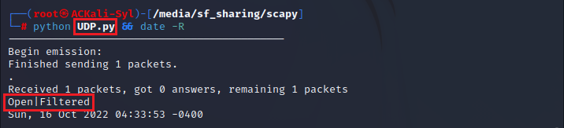

  对于没有回应的端口则认为是开放的

  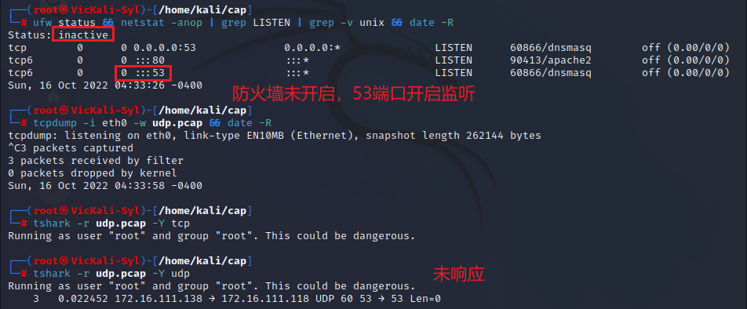

- **关闭**

  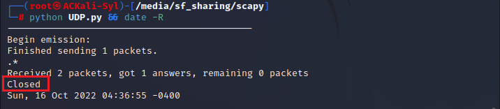

  收到一个 ICMP 不可到达的回应，那么则认为这个端口是关闭的

  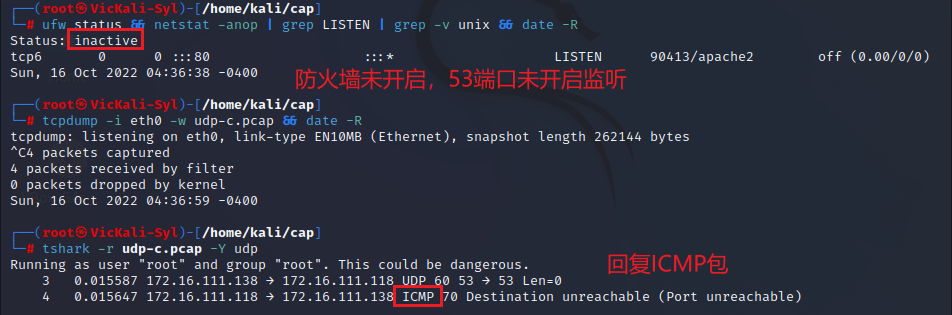

- **过滤**

  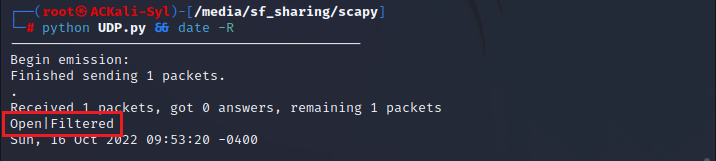

  对于没有回应的端口则认为是开放的

  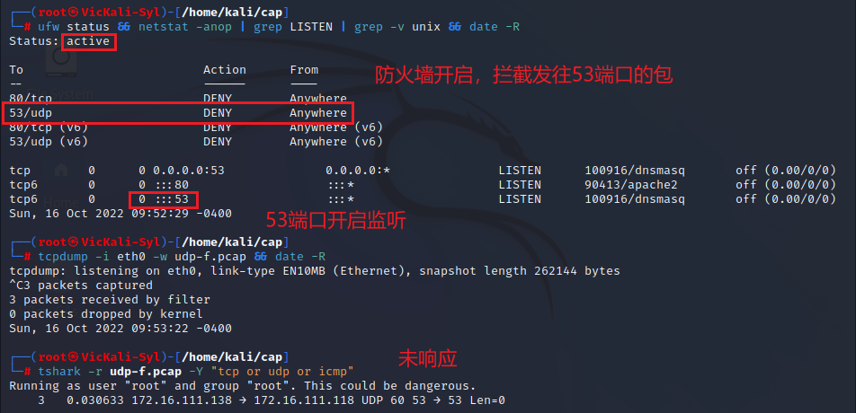

## 实验总结

- 操作TCP Connect扫描实验时发现端口为开放状态时抓包分析的结果与课本中的扫描方法原理并不相符

  TCP Connect作为一种开放性扫描在端口开放时应与被扫描端建立完整的三次握手连接，成功后再终止连接

  

  而实验中抓包的数据却显示在两次握手后`ACkali`（发起扫描端）却发出的是【RST】包，中断了连接的完整建立，这样的TCP Connect最后效果却与TCP SYN是一样的了，即变成了半开放扫描。

  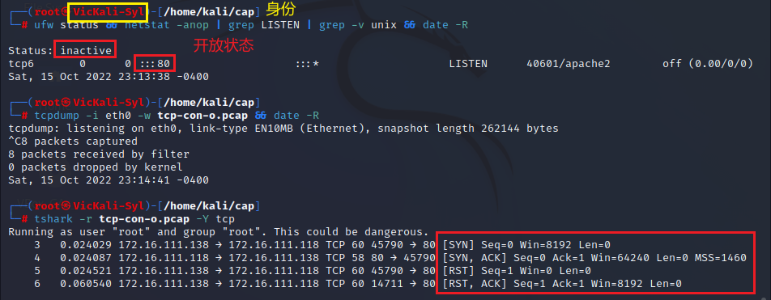

  本质上是因为Linux系统将比scapy更先接收SYN-ACK包，内核将发送一个RST，在scapy执行任何操作之前，操作系统选择不在有问题的端口号上打开一个`socket`

  解决方案是设置防火墙阻止内核发送RST包，使用`iptables`编写规则如下：

  ```
  iptables -A OUTPUT -p tcp --tcp-flags RST RST -d 172.16.111.118 -j DROP
  ```

  这样设置之后，系统虽然没有再发送RST包了，但第三次握手并未完成，原因是第三次握手用了一个新的端口，需要设置成第一次握手相同的端口，（端口号最好自行指定，比如12345之类，使用`randport（）`函数指定会导致两次端口不一）并设置`ack、seq`的值才可以完成三次握手（详细代码见[TCP connect scan](#2.1.1 TCP connect scan) ）

  修改完毕后再次分析抓包，得到与课本图中相同包

  

## 参考资料

- [python3 scapy 模拟 TCP三次握手（解决RST）](https://zhuanlan.zhihu.com/p/372206740)
- [scapy实现一个端口扫描器（基于tcp三次握手扫描）——简析](https://blog.csdn.net/think_ycx/article/details/50917715)